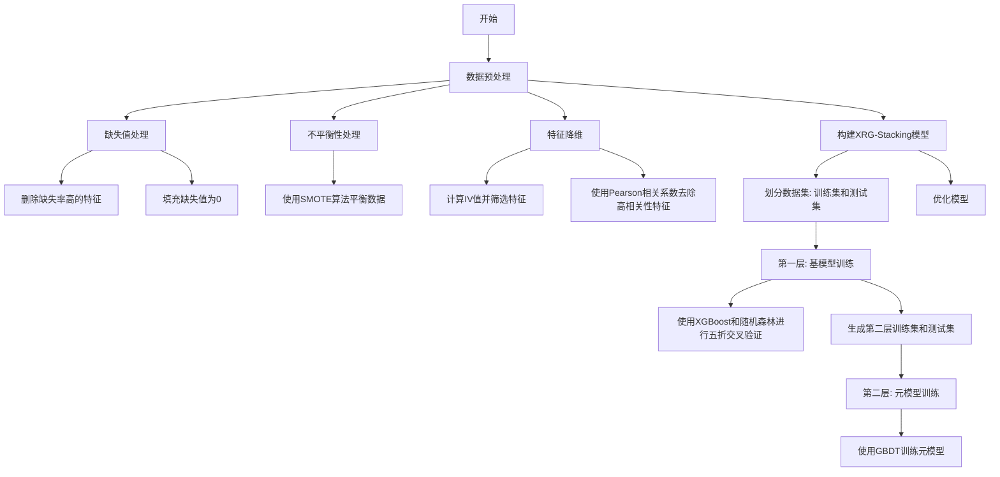

```mermaid
graph TD
    A[开始] --> B[数据预处理]
    B --> B1[缺失值处理]
    B1 --> B2[删除缺失率高的特征]
    B1 --> B3[填充缺失值为0]
    B --> B4[不平衡性处理]
    B4 --> B5[使用SMOTE算法平衡数据]
    B --> B6[特征降维]
    B6 --> B7[计算IV值并筛选特征]
    B6 --> B8[使用Pearson相关系数去除高相关性特征]
    B --> C[构建XRG-Stacking模型]
    C --> C1[划分数据集: 训练集和测试集]
    C1 --> C2[第一层: 基模型训练]
    C2 --> C3[使用XGBoost和随机森林进行五折交叉验证]
    C2 --> C4[生成第二层训练集和测试集]
    C4 --> C5[第二层: 元模型训练]
    C5 --> C6[使用GBDT训练元模型]
    C --> D[优化模型]
```