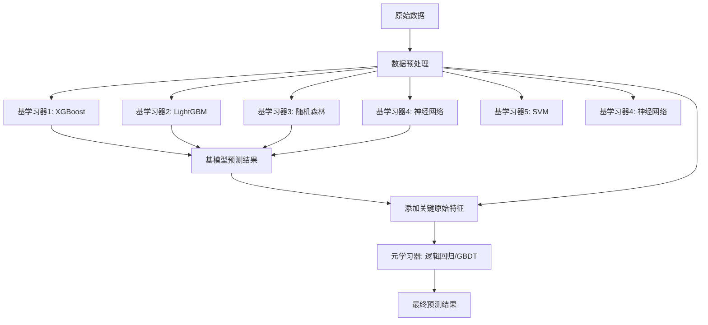

```mermaid
graph TD
    A[原始数据] --> B[数据预处理]
    B --> C1[基学习器1: XGBoost]
    B --> C2[基学习器2: LightGBM]
    B --> C3[基学习器3: 随机森林]
    B --> C4[基学习器4: 神经网络]
    B --> C5[基学习器5: SVM]
    B --> C6[基学习器4: 神经网络]
    C1 --> D[基模型预测结果]
    C2 --> D
    C3 --> D
    C4 --> D
    D --> E[元学习器输入特征]
    B --> E[添加关键原始特征]
    E --> F[元学习器: 逻辑回归/GBDT]
    F --> G[最终预测结果]
```